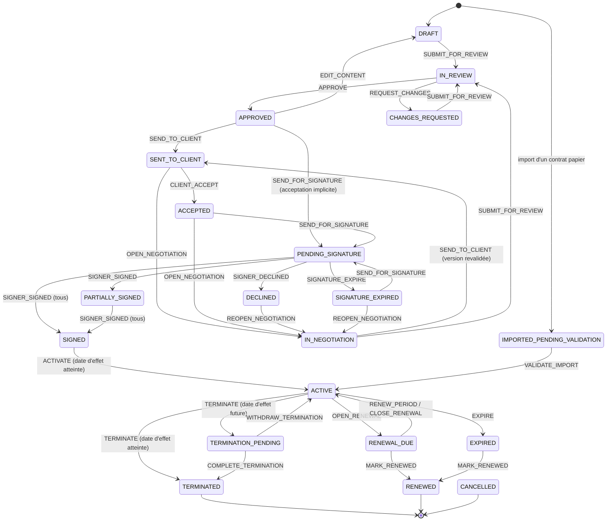

# 02 — Cycle de vie et machine à états

> Spécification de `packages/domain/src/contract/state-machine.ts`.
> Codes en anglais (base, API), libellés français à l'écran
> (`apps/web/src/lib/labels.ts`). Correspondance avec le brief :
> `00-architecture.md` §3.1.

## 1. Principes

1. **Machine pure.** `applyEvent(snapshot, event, now) → snapshot`. Aucune
   lecture d'horloge globale, aucun accès base : les gardes vivent dans le
   domaine, pas dans les contrôleurs ni dans l'interface.
2. **Trois contrôles distincts.** Le *rôle* (matrice `permissions.ts`), le
   *scope* (RLS) et l'*état* (cette machine) répondent à trois questions
   différentes. Un bouton grisé n'est pas un contrôle d'accès.
3. **Toute transition est tracée**, sans que le code applicatif ait à y
   penser : le trigger `contracts_status_transition` (migration 17) écrit une
   ligne `lifecycle_events` (de, vers, événement, motif, acteur, horodatage)
   et une entrée d'audit chaînée à chaque changement de `contracts.status`.
   Le service fournit l'événement et le motif via `setTransitionContext()`.
4. **Tests exhaustifs.** Pour chaque état × chaque événement : transition
   autorisée → état d'arrivée attendu ; transition non listée →
   `InvalidTransitionError`. La table ci-dessous EST le jeu de tests
   (`tests/contract-state-machine-v2.test.ts`).

## 2. Diagramme

`CANCEL` (motif obligatoire) est possible depuis tout état de `DRAFT` à
`PARTIALLY_SIGNED` inclus, ainsi que depuis `DECLINED`, `SIGNATURE_EXPIRED`
et `IMPORTED_PENDING_VALIDATION` (rejet d'un import). Il n'est plus possible
une fois le contrat signé : seule la résiliation l'est (RM-22).

## 3. Table des transitions

| État | Événements autorisés → état d'arrivée |
|---|---|
| `DRAFT` | `EDIT_CONTENT` → `DRAFT` · `SUBMIT_FOR_REVIEW` → `IN_REVIEW` · `CANCEL` → `CANCELLED` |
| `IN_REVIEW` | `APPROVE` → `APPROVED` · `REQUEST_CHANGES` → `CHANGES_REQUESTED` · `CANCEL` |
| `CHANGES_REQUESTED` | `EDIT_CONTENT` · `SUBMIT_FOR_REVIEW` → `IN_REVIEW` · `CANCEL` |
| `APPROVED` | `EDIT_CONTENT` → `DRAFT` (validation invalidée) · `SEND_TO_CLIENT` → `SENT_TO_CLIENT` · `SEND_FOR_SIGNATURE` → `PENDING_SIGNATURE` · `CANCEL` |
| `SENT_TO_CLIENT` | `CLIENT_ACCEPT` → `ACCEPTED` · `OPEN_NEGOTIATION` → `IN_NEGOTIATION` · `CANCEL` |
| `IN_NEGOTIATION` | `EDIT_CONTENT` → `IN_NEGOTIATION` (validation invalidée) · `SUBMIT_FOR_REVIEW` → `IN_REVIEW` · `SEND_TO_CLIENT` → `SENT_TO_CLIENT` · `CANCEL` |
| `ACCEPTED` | `SEND_FOR_SIGNATURE` → `PENDING_SIGNATURE` · `OPEN_NEGOTIATION` → `IN_NEGOTIATION` · `CANCEL` |
| `PENDING_SIGNATURE` | `SIGNER_SIGNED` → `PARTIALLY_SIGNED` / `SIGNED` · `SIGNER_DECLINED` → `DECLINED` · `SIGNATURE_EXPIRE` → `SIGNATURE_EXPIRED` · `REVOKE_SIGNATURE` → `ACCEPTED` si la version signée est la version acceptée, sinon `APPROVED` · `CANCEL` |
| `PARTIALLY_SIGNED` | idem `PENDING_SIGNATURE` |
| `DECLINED` | `REOPEN_NEGOTIATION` → `IN_NEGOTIATION` · `CANCEL` |
| `SIGNATURE_EXPIRED` | `REOPEN_NEGOTIATION` → `IN_NEGOTIATION` · `SEND_FOR_SIGNATURE` → `PENDING_SIGNATURE` · `CANCEL` |
| `SIGNED` | `ACTIVATE` → `ACTIVE` (reste `SIGNED` si date d'effet future, RM-06) · `TERMINATE` |
| `ACTIVE` | `EXPIRE` → `EXPIRED`/`RENEWED` · `TERMINATE` → `TERMINATION_PENDING`/`TERMINATED` · `OPEN_RENEWAL` → `RENEWAL_DUE` · `MARK_RENEWED` → `RENEWED` |
| `RENEWAL_DUE` | `RENEW_PERIOD` → `ACTIVE` · `CLOSE_RENEWAL` → `ACTIVE` · `MARK_RENEWED` → `RENEWED` · `EXPIRE` · `TERMINATE` |
| `TERMINATION_PENDING` | `COMPLETE_TERMINATION` → `TERMINATED` (date d'effet atteinte) · `WITHDRAW_TERMINATION` → `ACTIVE` |
| `EXPIRED` | `MARK_RENEWED` → `RENEWED` (renouvellement tardif rétroactif) |
| `IMPORTED_PENDING_VALIDATION` | `VALIDATE_IMPORT` → `ACTIVE` / `SIGNED` (effet futur) / `EXPIRED` (terme dépassé) · `CANCEL` |
| `TERMINATED`, `RENEWED`, `CANCELLED` | aucun (terminaux) |

## 4. Règles de garde

| Règle | Garde |
|---|---|
| RM-08 | Date d'effet obligatoire pour `SUBMIT_FOR_REVIEW` et `ACTIVATE`. |
| RM-10 | Le valideur (`APPROVE`, `REQUEST_CHANGES`) ne peut pas être celui qui a soumis. |
| RM-11 | Une validation porte sur une **version**. Toute édition après validation l'invalide. `SEND_TO_CLIENT` et `SEND_FOR_SIGNATURE` exigent `approvedVersionId = currentVersionId`. |
| RM-12 | Au moins un signataire LSI et un signataire client avant soumission. |
| V2-ACC | **Acceptation distincte de la signature** : `CLIENT_ACCEPT` enregistre la version acceptée (`acceptedVersionId`), l'horodatage, le nom, l'e-mail et l'IP de l'acceptant (table `contract_acceptances`, append-only). Refusé si la version présentée n'est pas la version courante validée. Depuis `ACCEPTED`, `SEND_FOR_SIGNATURE` exige `acceptedVersionId = currentVersionId`. |
| V2-LOCK | **Verrouillage** : en `PENDING_SIGNATURE`/`PARTIALLY_SIGNED`, aucune édition. Modifier le texte exige de révoquer la soumission (`REVOKE_SIGNATURE`) — ce qui annule la soumission DocuSeal — puis d'éditer, ce qui crée une nouvelle version. |
| V2-AI | Un contrat d'origine `AI` ne peut pas être soumis (`SUBMIT_FOR_REVIEW`) tant qu'une clause générée n'a pas été validée par un humain (`hasUnreviewedAiClauses`). |
| V2-IMP | `VALIDATE_IMPORT` exige une date d'effet et le document original ; il est réservé aux rôles `imports.validate`. L'état d'arrivée est déduit des dates, pas choisi par l'utilisateur. |
| RM-20 | Résiliation : motif obligatoire ; date d'effet calculée selon le préavis (§5) ; y déroger exige un admin et une justification tracée. |
| RM-22 | Annulation : motif obligatoire ; impossible une fois signé. |

## 5. Dates : préavis, dénonciation, reconduction

Fonctions pures de `packages/domain/src/contract/dates.ts`, toutes en dates
calendaires UTC (minuit), affichées en `Europe/Paris`.

- **Préavis** exprimé en jours *ou* en mois (`noticePeriodDays` /
  `noticePeriodMonths`, exclusifs). Les mois suivent l'arithmétique
  calendaire avec rabattement en fin de mois (31 janvier − 1 mois = 31
  décembre ; 31 mars − 1 mois = 28/29 février).
- **Date limite de dénonciation** = fin de période − préavis.
- **Date d'effet d'une résiliation** (`computeTerminationEffectiveDate`) :
  - durée indéterminée : `max(date demandée, aujourd'hui + préavis)` ;
  - période à terme : la fin de la période en cours si la dénonciation
    intervient au plus tard à la date limite, sinon la fin de la période
    suivante (le contrat aura été tacitement reconduit entre-temps).
- **Reconduction** (`renewalMode`) :
  - `NONE` : le contrat expire à son terme (comportement historique) ;
  - `TACIT` : à la fin d'une période non dénoncée, le job quotidien crée une
    nouvelle `ContractPeriod` (durée `renewalPeriodMonths`) et avance
    `endDate` — événement `RENEW_PERIOD`, acteur `SYSTEM` (V2-H10) ;
  - `EXPRESS` : `OPEN_RENEWAL` à la date limite de dénonciation ; sans
    décision expresse avant le terme, le contrat expire.
- **Loi Chatel** (art. L215-1 C. conso., V2-H11) : si le client est un
  consommateur ou un non-professionnel (`Customer.isConsumer`), ou si
  l'option est forcée sur le contrat (`chatelNotice = true`), une échéance
  `CHATEL_NOTICE` est créée : l'information sur la faculté de ne pas
  reconduire doit être envoyée **au plus tôt 3 mois et au plus tard 1 mois
  avant la date limite de dénonciation**. À défaut, le consommateur peut
  résilier à tout moment après la reconduction : l'échéance passe en alerte
  rouge et le contrat est marqué `chatelBreach`. **À faire valider par un
  juriste.**

### 5.1 Câblage (lot 5, migration 25)

| Élément | Implémentation |
|---|---|
| Découverte reconduction tacite | `app_find_tacit_renewals_due` : `MAIN`, `ACTIVE`/`RENEWAL_DUE`, `TACIT`, terme dépassé |
| Découverte renouvellement exprès | `app_find_express_renewals_to_open` : `ACTIVE`, `EXPRESS`, date limite (`app_notice_deadline`) atteinte |
| Expiration | `app_find_contracts_to_expire` exclut désormais `TACIT` et inclut `RENEWAL_DUE` |
| Job quotidien (`LifecycleService.run`) | activer → **reconduire** (`OPEN_RENEWAL` + `RENEW_PERIOD` par période manquée, rattrapage borné à 50) → ouvrir les renouvellements exprès → expirer → achever les résiliations |
| `POST /v1/contracts/:id/renewal/renew` `{months?}` | renouvellement décidé : période `EXPRESS_RENEWAL` (ou `TACIT_RENEWAL`), durée par défaut `renewalPeriodMonths` |
| `POST /v1/contracts/:id/renewal/close` `{reason}` | non-renouvellement décidé : retour `ACTIVE`, expiration au terme |
| `GET /v1/contracts/:id/termination-preview?requestedDate=` | date d'effet calculée, date limite, dépassement |
| `POST /v1/contracts/:id/terminate` | `effectiveDate` **facultative** : absente, elle est calculée côté serveur |
| `POST /v1/contracts/:id/termination-letter` (multipart `letter`, PDF) | `StoredDocument TERMINATION_LETTER`, empreinte SHA-256 à réception ; seulement en `TERMINATION_PENDING`/`TERMINATED` |
| `POST /v1/contracts/:id/withdraw-termination` `{reason}` | `WITHDRAW_TERMINATION` → `ACTIVE`, échéancier recalculé |

Toutes les transitions passent par `persistTransition` (machine + événement
de cycle de vie + webhooks sortants). Droits : `contracts.lifecycle`
(MSP_ADMIN, ACCOUNT_MANAGER) ; aperçu : `contracts.read`.

## 6. Échéancier

Le job quotidien du worker (`DeadlinesService.recompute`) matérialise pour
chaque contrat actif les `Deadline` : `PERIOD_END`, `NOTICE_DEADLINE`,
`PRICE_REVISION`, `RENEWAL_DECISION`, `CHATEL_NOTICE`,
`TERMINATION_EFFECTIVE`. Il émet des alertes aux seuils du tenant
(`alerts.thresholdsDays`, défaut 90/60/30/7) vers les utilisateurs concernés
(propriétaire du contrat, admins) et vers les webhooks sortants
(`contract.renewal_due`). Une alerte est unique par (échéance, seuil) :
contrainte en base, pas un `if`.
