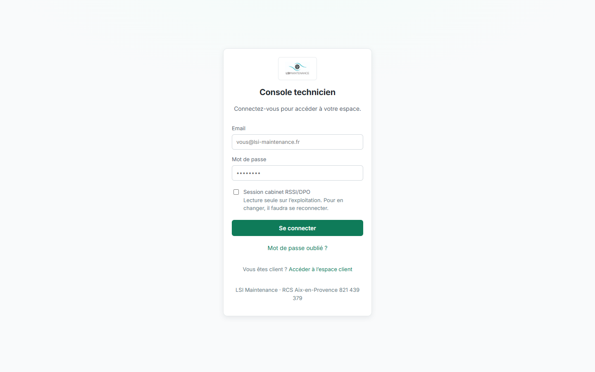
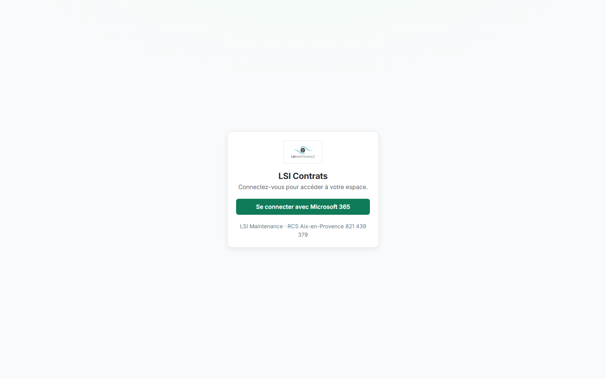
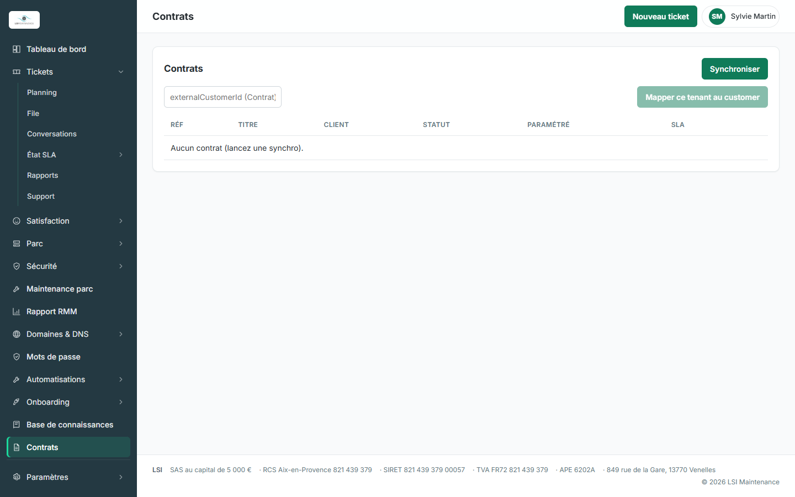
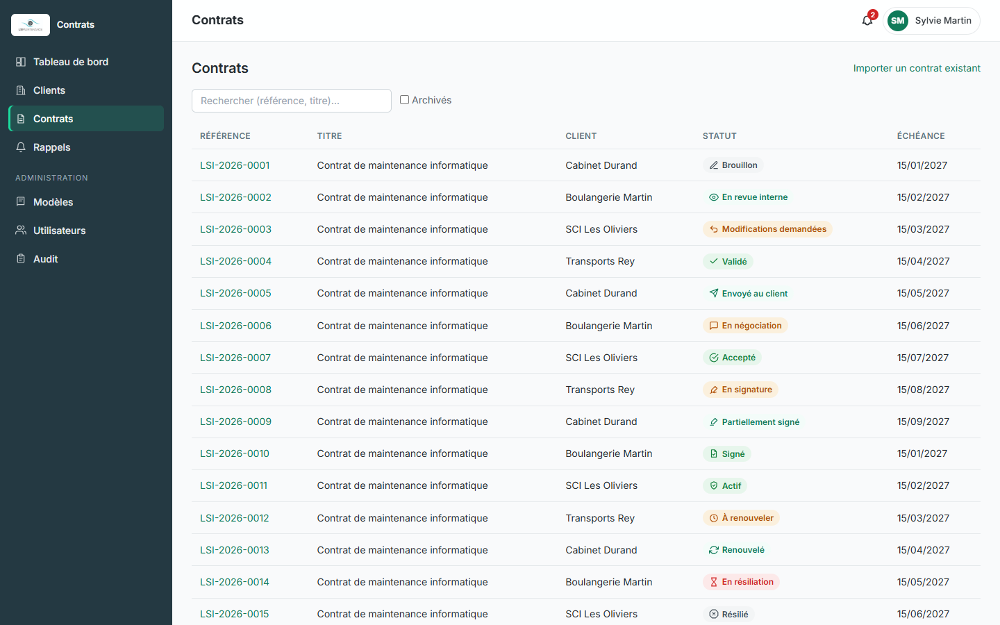

# 10 — Charte graphique : alignement sur lticket

> Exigence (brief §11) : l'application Contrats doit être **visuellement indiscernable de lticket**.
> Source de vérité : dépôt `LSIParis/ticket`, application `apps/console` (lue sans modification,
> commit `c2e8b79f`). Le portail client de lticket (`apps/portal/src/styles.css`) partage la même palette.

## 1. Constat

- lticket **n'expose aucun paquet partagé** (ni thème, ni composants, ni config Tailwind) : son design
  system est une feuille CSS écrite à la main, `apps/console/src/styles.css` (≈ 1 500 lignes, classes
  sémantiques `.card`, `.badge`, `.tabbar`…). Les jetons ont donc été **recopiés** dans
  `apps/web/src/ui/theme/` avec la référence fichier:ligne de chaque groupe.
- Contrats reste en **Tailwind 3** : les jetons lticket sont exposés en variables CSS
  (`tokens.css`), en export TypeScript (`tokens.ts`) et mappés dans `apps/web/tailwind.config.ts`.
  Le test `theme-tokens.test.ts` échoue si CSS et TS divergent.
- **Palette réelle de lticket ≠ identité de repli du brief.** lticket utilise une menthe `#1BDA9D`
  (primaire lisible `#0F7B59`) et un pétrole `#243942`, pas `#50FFC1` / `#1C3B3F` ; une seule
  police (Inter), pas de DM Sans. Conformément au brief (« identique à lticket »), **c'est lticket
  qui fait foi** ; l'identité de repli n'a pas été utilisée (aucun jeton manquant ne l'a exigée).

## 2. Correspondance des jetons

Références : `styles.css` = `D:\Code\ticket\apps\console\src\styles.css`.

| Groupe | Jeton lticket (fichier:ligne) | Valeur | Jeton Contrats (CSS / Tailwind) |
|---|---|---|---|
| Menthe | `--mint-50…950` (styles.css:8-10) | `#F3FCF9` … `#0F7B59` (800) … `#062D21` | `--mint-*` / `mint-*` |
| Pétrole | `--petrol-700…950` (styles.css:12) | `#3B5E6D` `#304D5A` `#243942` `#121D21` | `--petrol-*` / `petrol-*` |
| Neutres | `--slate-50…950` (styles.css:14-16) | `#F9FAFB` … `#232A2F` (900) … `#14171A` | `--slate-*` / `slate-*` **et `gray-*`** (échelle Tailwind remplacée) |
| Succès | `--success`, `--success-bg` (styles.css:28) | `#117F3A` / `#E7F6EC` | `success`, `success-bg` |
| Alerte | `--warn`, `--warn-bg` (styles.css:29) | `#B25209` / `#FBF0DD` | `warn`, `warn-bg` |
| Danger | `--danger`, `--danger-bg` (styles.css:30) ; survol `.btn-danger:hover` (styles.css:234) | `#D12424` / `#FCE9E9` ; `#B91C1C` | `danger`, `danger-bg`, `danger-hover` ; `red-600/700` |
| Info | `--info`, `--info-bg` (styles.css:31) | menthe 800 / menthe 50 | `info`, `info-bg` |
| Fond de page | `--bg` (styles.css:34) | slate 50 | `--bg` / `page` |
| Surface | `--surface` (styles.css:35) | `#FFFFFF` | `surface` |
| Bordures | `--border`, `--border-strong` (styles.css:36-37) | slate 200 / slate 300 | `line`, `line-strong` (+ bordure par défaut) |
| Textes | `--text`, `--text-muted`, `--text-faint` (styles.css:38-42) | slate 900 / slate 600 / `#637684` | `ink`, `ink-muted`, `ink-faint` |
| Primaire | `--primary`, `--primary-hover` (styles.css:43-44) | `#0F7B59` / `#0B5B42` | `primary`, `primary-hover`, **`lsi` / `lsi-dark`** (remplace le provisoire `#0b5cad`) |
| Accent | `--accent` (styles.css:45) | `#1BDA9D` | `accent` |
| Focus | `--focus` (styles.css:49) | `#13966C` (3,75:1) | `focus`, anneau global |
| Voile modal | `.modal-fond` (styles.css:749) | `rgba(18,29,33,.45)` | `--overlay` |
| Rayons | `--radius-sm/--radius/--radius-lg/--radius-full` (styles.css:52) | 6 / 10 / 14 / 999 px | `rounded` (6), `rounded-lg` (10), `rounded-xl` (14), `rounded-full` |
| Ombres | `--shadow-sm/--shadow/--shadow-md/--shadow-pop` (styles.css:53-56) | voir fichier | `shadow-sm`, `shadow`, `shadow-md`, `shadow-lg`/`shadow-pop` |
| Espacements | `--space-1…6` (styles.css:57) | 4 / 8 / 12 / 16 / 24 / 32 px | identiques à l'échelle Tailwind `1 2 3 4 6 8` |
| Gabarit | `--sidebar-w`, `--content-max` (styles.css:58-59) ; `.topbar` 60 px (styles.css:145-150) | 248 px / 1180 px / 60 px | `--sidebar-w`, `max-w-content`, `h-topbar` |
| Police | `--font` (styles.css:60) ; `@fontsource/inter` 400-700 (console/src/main.tsx:3-6) | Inter | `--font`, `font-sans` |
| Corps | `body` (styles.css:67-75) | 14 px / 1,5, antialiasé | `@layer base` de `index.css` |
| Titres | `h1,h2,h3` (styles.css:76-77) | graisse 650, −0,01em ; 22 / 17 / 15 px | `@layer base` ; `font-title`, `text-22/17/15` |
| Graisses | boutons/onglets 550, titres 650, en-tête de fiche 680 (styles.css:212, 605, 561) | | `font-button`, `font-title`, `font-heading` |
| Échelle de corps | 11 · 12 · 12,5 · 13 · 14 · 15 · 17 · 18 · 22 · 26 px | | `text-2xs`, `text-xs`, `text-xs+`, `text-13`, `text-sm`, `text-15`, `text-17`, `text-18`, `text-22` |

## 3. Correspondance des composants

| lticket | Contrats |
|---|---|
| `.shell`, `.sidebar`, `.nav-item(.active)`, `.nav-label` (styles.css:83-115), `components/Sidebar.tsx` | `ui/layout.tsx` : `Shell`, `Sidebar`, `NavItem`, `NavSection` |
| `.brand-chip` + `public/logo-lsi.jpg` (styles.css:95-96) | `BrandChip` + `apps/web/public/logo-lsi.jpg` (copié) |
| `.topbar` (styles.css:145-152), `App.tsx` `Topbar` | `Topbar` (titre de section ; non-`h1` car la page a le sien) |
| `.avatar` (styles.css:160-170), `AccountMenu.tsx` | `AccountChip` |
| `.footer`, `components/Footer.tsx` | `LegalFooter` |
| `.auth-wrap`, `.auth-card`, `pages/Login.tsx` | `AuthScreen` (connexion interne, portail, fin de signature) |
| `button`, `.btn-secondary`, `.btn-ghost`, `.btn-danger`, `.btn-danger-ghost`, `.btn-warn`, `.btn-sm` | `ui/button.tsx` (`variant`, `size`) + `buttonClass()` |
| `.card` (styles.css:196-202) | `ui/card.tsx` |
| `.field`, `input/select/textarea` (styles.css:270-284, 493-497) | `ui/field.tsx`, `ui/input.tsx`, `ui/select.tsx` + base `index.css` |
| `table`, `thead th`, `tbody td`, `.table-wrap` (styles.css:309-325) | `ui/table.tsx` |
| `.badge`, `.badge-ok/warn/danger/info/p4` (styles.css:287-307) ; `ui.tsx` `StatusBadge` | `ui/badge.tsx` (`Badge`), `ui/status-badge.tsx` |
| `.tabbar`, `.tab` (styles.css:604-608), `components/Tabs.tsx` | `ui/tabs.tsx` |
| `.modal-fond`, `.modal-carte` (styles.css:746-755), `components/Dialog.tsx` | `ui/modal.tsx` (`center` / `side`) |
| `.session-preavis` (styles.css:667-689) — seul avis flottant de lticket | `ui/toast.tsx` (`ToastProvider`, `useToast`) |
| `.crumb` (styles.css:559), `nav.breadcrumb` « Parent › Page » (pages/Dns.tsx:94) | `ui/breadcrumb.tsx` |
| `.empty` (styles.css:407) | `ui/spinner.tsx` (même gabarit + anneau) |
| `nav/icones.ts` + `Ic` (Sidebar.tsx) | `ui/icons.tsx` (`ICONS`, `Icon`) |

**Icônes** : lticket n'utilise **aucune bibliothèque** ; c'est un dictionnaire de tracés SVG au trait
(grille 24, `stroke="currentColor"`, épaisseur 1,8, extrémités rondes — style Feather). Contrats reprend
la même convention (`ui/icons.tsx`), avec les tracés lticket (`dash`, `contract`, `book`, `shield`,
`settings`, `calendar`, chevron) et des tracés supplémentaires dans le même style.

**Mode sombre** : lticket n'en a pas (`color-scheme: light`, styles.css:62, aucune règle
`prefers-color-scheme`). Contrats n'en a donc pas non plus.

## 4. Polices et auto-hébergement

- Famille unique **Inter**, graisses **400 / 500 / 600 / 700**, via `@fontsource/inter` (même paquet
  et mêmes graisses que lticket, `apps/console/src/main.tsx:3-6`). Les fichiers `.woff2/.woff` sont
  émis par Vite dans `dist/assets/` et servis par l'application : **aucun appel à Google Fonts ni à un
  CDN** (vérifié : aucune occurrence de `googleapis`/`gstatic` dans le build).
- Les graisses intermédiaires de lticket (550, 650, 680) sont rendues par le navigateur à partir de ces
  fichiers statiques, exactement comme dans lticket.
- DM Sans (évoquée par le brief en repli) **n'est pas utilisée** : lticket ne l'utilise pas.

## 5. Badges de statut du cycle de vie

Une couleur (ton de pastille lticket) + une **icône distincte** + un **libellé français** par statut
(`ui/theme/status.ts`, libellés dans `lib/labels.ts`). La couleur ne porte jamais seule le sens.
Contrastes mesurés (WCAG 2.x, texte / fond) — tous ≥ 4,5:1, vérifiés par `status-badge.test.tsx` :

| Ton (classe lticket) | Texte / fond | Rapport | Statuts |
|---|---|---|---|
| neutre (`.badge`) | `#424E57` / `#F3F5F6` | **7,81:1** | Brouillon (crayon), Résilié (octogone ×) |
| atténué (`.badge-p4`) | `#53636E` / `#F3F5F6` | **5,69:1** | Annulé (sens interdit) |
| info (`.badge-info`) | `#0F7B59` / `#F3FCF9` | **5,03:1** | En revue interne (œil), Envoyé au client (avion), Partiellement signé (stylo), Renouvelé (flèches) |
| succès (`.badge-ok`) | `#117F3A` / `#E7F6EC` | **4,56:1** | Validé (coche), Accepté (coche cerclée), Signé (document coché), Actif (bouclier) |
| alerte (`.badge-warn`) | `#B25209` / `#FBF0DD` | **4,53:1** | Modifications demandées (retour), En négociation (bulle), En signature (signature), À renouveler (horloge), Importé à valider (import) |
| danger (`.badge-danger`) | `#D12424` / `#FCE9E9` | **4,51:1** | En résiliation (sablier), Expiré (calendrier ×), Refusé (cercle ×), Signature expirée (alerte) |

Autres contrastes vérifiés (`theme-tokens.test.ts`) : texte 14,55:1 sur blanc, 13,92:1 sur fond ;
atténué 6,22:1 ; discret 4,71:1 (4,51:1 sur fond) ; lien primaire 5,25:1 ; bouton primaire blanc sur
menthe 800 5,25:1 (survol 8,11:1) ; bouton danger 5,26:1 (survol 6,47:1) ; menu latéral 9,88:1,
intitulés de section 4,78:1. Anneau de focus menthe 700 : 3,75:1 (seuil 3:1, WCAG 1.4.11).

Libellés de référence : les libellés existants « En relecture », « Approuvé » et « En attente de
signature » ont été remplacés par « En revue interne », « Validé » et « En signature » (liste de
référence des statuts) ; sept statuts ont été ajoutés (`SENT_TO_CLIENT`, `IN_NEGOTIATION`, `ACCEPTED`,
`RENEWAL_DUE`, `TERMINATION_PENDING`, `SIGNATURE_EXPIRED`, `IMPORTED_PENDING_VALIDATION`).

## 6. Accessibilité (RGAA de base)

- Anneau de focus `:focus-visible` menthe 700 sur tout élément cliquable, halo sur les champs.
- Lien d'évitement « Aller au contenu » ; `nav` nommée « Navigation principale » ; `aria-current` sur
  l'entrée active et la dernière miette du fil d'Ariane.
- Onglets : motif WAI-ARIA (flèches, Début, Fin, tabindex glissant, panneau focusable).
- Modale : `role="dialog"`, `aria-modal`, `aria-labelledby`, focus piégé et restitué, Échap.
- Toasts : région `aria-live`, erreurs en `role="alert"` sans disparition automatique.
- Champs : libellé relié par `htmlFor`, aide et erreur reliées par `aria-describedby`, `aria-invalid`.
- Chargement annoncé (`role="status"`).

## 7. Captures comparatives

Captures réalisées le 2026-09-26 à 1440×900, serveurs Vite de développement des deux applications,
réponses d'API simulées dans le navigateur (`page.route`) — aucune donnée réelle :

| Écran | lticket | Contrats |
|---|---|---|
| Connexion |  |  |
| Liste des contrats (coquille, tableau, badges) |  |  |

Pour les reproduire :

1. lticket : `cd D:\Code\ticket\apps\console && ..\..\node_modules\.bin\vite --port 5189` puis
   ouvrir `http://localhost:5189/tech/` (connexion). Pour la coquille, intercepter `**/api/**`
   (`/api/auth/me` → `{ role: 'admin', displayName, mfaRequirement: 'aucune' }`, le reste → `[]`),
   poser `localStorage.ticket_tech_token`, ouvrir `/tech/contracts`.
2. Contrats : `pnpm --filter @lsi/web dev -- --port 5188`, intercepter `**/v1/**`
   (`/v1/auth/me`, `/v1/notifications`, `/v1/contracts` avec un contrat par statut), ouvrir
   `/contracts` ; pour la connexion, répondre 401 à `/v1/auth/me`.
3. `playwright-cli resize 1440 900` puis `playwright-cli screenshot --filename=…` dans `docs/contrats/img/`.

Reste à faire (TODO) :

- [ ] Captures de la fiche contrat (onglets) et d'une modale une fois la fiche à onglets du brief
      (Synthèse, Contenu, Annexes…) branchée sur `ui/tabs.tsx` et les confirmations sur `ui/modal.tsx`.
- [ ] Captures du portail client face au portail de lticket (`apps/portal`).

## 8. Écarts assumés et suite

- Les **pages** existantes n'ont pas été réécrites (périmètre : présentation des composants et de la
  coquille). Elles héritent néanmoins de la charte via le remappage Tailwind (`gray`→slate lticket,
  `lsi`→primaire, `rounded`→6 px, `red-600`→danger) et la base CSS. Les titres de page conservent
  leurs classes (`text-xl`), les listes ne sont pas encore posées dans des cartes comme dans lticket.
- `docs/contrats/00-architecture.md` n'existe pas encore dans ce dépôt : cette note est autonome.

**Recommandation — extraire un paquet `@lsi/ui`.** Aujourd'hui la charte vit en deux copies (CSS écrite
à la main dans lticket, jetons recopiés ici) : toute correction de contraste faite d'un côté doit être
reportée à la main de l'autre. Proposition :

1. Créer `@lsi/ui` (dépôt ou workspace partagé, publié sur le registre npm privé GHCR) contenant
   `tokens.css` + `tokens.ts` (source unique), le preset Tailwind, `icons` et les primitives React
   accessibles (Button, Field, Table, StatusBadge, Tabs, Modal, Toast, Breadcrumb, Shell).
2. lticket consomme d'abord **seulement `tokens.css`** (remplace son bloc `:root`, sans toucher à ses
   classes) ; Contrats consomme jetons + preset + composants.
3. Le test de contraste de ce dépôt migre dans le paquet et devient la garde commune (AA ≥ 4,5:1).
